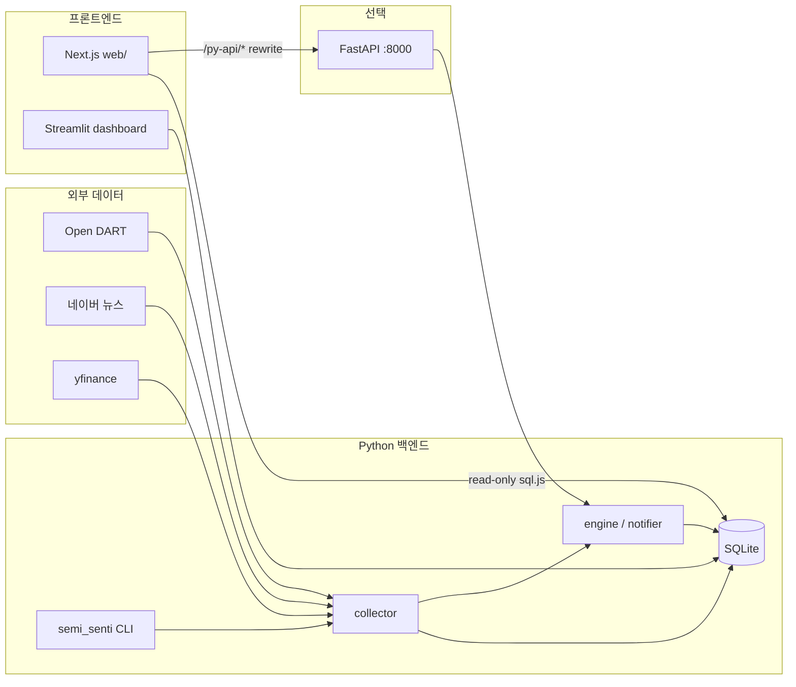

# Semi Senti

반도체 특화 NLP 감성 분석과 재무 펀더멘털을 결합해, 개인 투자자에게 **객관적인 매매 타점 참고 신호**를 제공하는 주가 분석 서비스입니다.

| 구분 | 기술 |
|------|------|
| 데이터·분석 | Python 3.8+ · SQLite · Open DART · 네이버 뉴스 · yfinance |
| 레거시 UI | Streamlit + TradingView Lightweight Charts |
| **권장 UI** | **Next.js 14** · Tailwind · Shadcn UI · sql.js (read-only DB) |
| 엔진 API (선택) | FastAPI · Uvicorn (`/py-api/*` 프록시) |

기본 분석 종목: **삼성전자(005930)**, **SK하이닉스(000660)**.  
상세 요구사항·태스크·릴리즈 이력은 [`docs/PRD.md`](docs/PRD.md), [`docs/Tasks.md`](docs/Tasks.md), [`docs/RELEASE_NOTES.md`](docs/RELEASE_NOTES.md)를 참고하세요.

---

## 아키텍처 개요



---

## Quick Start (clone 직후)

`git clone` 직후 **한 번** 실행하면 가상환경 생성 → 의존성 설치 → DB 초기화 → 기본 종목·샘플 재무 시딩까지 완료됩니다.

### Windows (CMD / PowerShell)

```bat
git clone <REPO_URL> semi-senti
cd semi-senti
setup.bat
```

PowerShell에서도 `.\setup.bat` 로 동일합니다. (실행 정책 이슈 시 스크립트가 `.\.venv\Scripts\python.exe` 를 직접 호출합니다.)

### macOS / Linux

```bash
git clone <REPO_URL> semi-senti
cd semi-senti
chmod +x setup.sh
./setup.sh
```

### `setup` 이 수행하는 단계

| # | 단계 | 설명 |
|---|------|------|
| 1 | Python 탐색 | 3.12 → 3.11 → 3.10 → 3.9 → 3.8 순 자동 선택 |
| 2 | `.venv` 생성 | 없으면 생성, 있으면 재사용 |
| 3 | 패키지 설치 | `pip install -r requirements.txt` + `pip install -e . --no-deps` |
| 4 | `.env` 보강 | 없으면 `.env.example` → `.env` 복사 |
| 5 | DB 시딩 | `db_seed.py` — 스키마 7테이블 + 삼성전자·SK하이닉스 + 샘플 `financials` |

### 시딩만 다시 실행

```bash
.\.venv\Scripts\python.exe db_seed.py              # 기본: 멱등 upsert
.\.venv\Scripts\python.exe db_seed.py --force      # financials 더미 강제 재적재
.\.venv\Scripts\python.exe db_seed.py --reset-db   # DB 파일 삭제 후 재생성
```

### 종료 코드 (CI)

| 코드 | 의미 |
|------|------|
| 0 | 정상 |
| 10 | Python 3.8+ 미감지 |
| 20 | 가상환경 생성 실패 |
| 30 | `pip install` 실패 |
| 40 | `db_seed.py` 실패 |

---

## 전체 스택 실행 (권장 워크플로)

### 1. 환경 변수

```bash
cp .env.example .env          # Windows: copy .env.example .env
```

| 변수 (필수도) | 용도 |
|---------------|------|
| `OPEN_DART_API_KEY` | 재무제표 수집 **필수** (실데이터) |
| `NAVER_CLIENT_ID` / `NAVER_CLIENT_SECRET` | 뉴스 수집 |
| `TELEGRAM_BOT_TOKEN` / `TELEGRAM_CHAT_ID` | 알림 (Phase 4) |
| `SEMI_SENTI_SQLITE_PATH` | Python DB 경로 (기본 `./db/semisenti.db`) |

전체 목록: [`.env.example`](.env.example)

### 2. Python — DB·수집·분석

```bash
# 가상환경 활성화 후 (Windows 예시)
.\.venv\Scripts\Activate.ps1

# 최초 1회 (setup.bat 이 이미 했다면 생략 가능)
python -m semi_senti init-db

# 실데이터 수집 (기본 종목 예시)
python -m semi_senti collect dart  --stock-code 005930 --corp-code 00126380 --stock-name 삼성전자
python -m semi_senti collect dart  --stock-code 000660 --corp-code 00164779 --stock-name SK하이닉스
python -m semi_senti collect price --stock-code 005930 --stock-name 삼성전자 --market KOSPI --force
python -m semi_senti collect price --stock-code 000660 --stock-name SK하이닉스 --market KOSPI --force
python -m semi_senti collect news  --stock-code 005930 --stock-name 삼성전자 --query "삼성전자 HBM 반도체"

# 분석
python -m semi_senti analyze sentiment  --stock-code 005930
python -m semi_senti analyze signal     --stock-code 005930
python -m semi_senti analyze divergence --stock-code 005930
python -m semi_senti analyze cycle      --stock-code 005930
```

일괄 데모 수집·분석: `python scripts/seed_demo_data.py`  
(종목 upsert + 주가·뉴스·DART + 감성·시그널·다이버전스·사이클)

### 3. Next.js 대시보드 (Phase 5, 권장 UI)

```powershell
cd web
# Python 과 동일 DB 파일을 가리키도록 설정 (중요)
echo SEMI_SENTI_DB_PATH=../db/semisenti.db > .env.local
npm install
npm run dev    # http://localhost:3000
```

| 경로 | 설명 |
|------|------|
| `/` | 메인 대시보드 (종목 선택·차트·감성·재무·시그널) |
| `/admin` | 종목 CRUD · 시스템 모니터 |

Next.js API (서버, sql.js):

- `GET /api/health` — DB 연결 상태
- `GET /api/stocks` — 활성 종목 목록
- `GET /api/snapshot/[code]` — 대시보드 스냅샷 JSON
- `GET/POST/DELETE /api/admin/stocks` — 종목 관리
- `GET /api/admin/system` — 테이블 건수·종목별 수집 상태

자세한 UI·디렉터리: [`web/README.md`](web/README.md)

> **DB 경로 주의:** Python 기본값은 `db/semisenti.db` 이고, Next.js 기본값은 `db/semi_senti.sqlite` 입니다.  
> **반드시** `web/.env.local` 의 `SEMI_SENTI_DB_PATH` 를 Python 과 같은 파일로 맞추세요.

### 4. FastAPI 어댑터 (선택, T-058)

분석·관리 엔진을 HTTP로 노출합니다. Next.js `next.config.mjs` 가 `/py-api/*` → `http://127.0.0.1:8000/api/*` 로 프록시합니다.

```bash
pip install -e ".[api]"
python -m semi_senti.api    # http://127.0.0.1:8000  (Swagger: /docs)
```

주요 엔드포인트: `GET /health`, `GET /api/stocks`, `POST /api/stocks`, `GET /api/system/status`, `POST /api/refresh`

### 5. Streamlit 대시보드 (레거시, Phase 3)

```bash
pip install -e ".[dashboard]"
python -m semi_senti dashboard            # http://localhost:8501
# 또는
streamlit run src/semi_senti/dashboard/app.py
```

---

## CLI 레퍼런스

```bash
python -m semi_senti --version
python -m semi_senti init-db [--db PATH] [--force]

# 수집
python -m semi_senti collect price --stock-code <6자리> [--stock-name] [--market KOSPI|KOSDAQ] [--force]
python -m semi_senti collect news  --stock-code <6자리> --query "<키워드>" [--force]
python -m semi_senti collect dart  --stock-code <6자리> --corp-code <DART 8자리> [--bsns-year]

# 분석
python -m semi_senti analyze sentiment  --stock-code <6자리> [--score-date YYYY-MM-DD]
python -m semi_senti analyze signal     --stock-code <6자리>
python -m semi_senti analyze divergence --stock-code <6자리> [--window-days N]
python -m semi_senti analyze cycle      --stock-code <6자리>

# 알림
python -m semi_senti notify test --message "hello"
python -m semi_senti notify signal --stock-code <6자리>
python -m semi_senti notify sentiment-shift --stock-code <6자리>

# 관리
python -m semi_senti admin list [--include-inactive]
python -m semi_senti admin add     --stock-code <6자리> --stock-name "<이름>" [--market KOSPI] [--no-validate]
python -m semi_senti admin update  --stock-code <6자리> [--stock-name] [--market]
python -m semi_senti admin delete  --stock-code <6자리> [--soft]
python -m semi_senti admin status
python -m semi_senti admin refresh --stock-code <6자리> [--query "<뉴스 키워드>"]

# 대시보드
python -m semi_senti dashboard [--port 8501] [--address localhost] [--headless]
```

### 기본 종목 · DART corp_code

| 종목 | 코드 | DART corp_code |
|------|------|----------------|
| 삼성전자 | `005930` | `00126380` |
| SK하이닉스 | `000660` | `00164779` |

---

## Development Setup

### Python 버전

**3.10 ~ 3.12** 권장 (`pandas` wheel 호환). **3.14** 는 일부 의존성 wheel 이 없어 실패할 수 있습니다.

### 가상환경

**Windows (PowerShell)**

```powershell
py -3.12 -m venv .venv
.\.venv\Scripts\Activate.ps1
python -m pip install --upgrade pip
pip install -r requirements.txt
pip install -e .
```

실행 정책 오류 시 활성화 없이:

```powershell
.\.venv\Scripts\python.exe -m pip install -r requirements.txt
.\.venv\Scripts\python.exe -m pip install -e .
```

**macOS / Linux**

```bash
python3 -m venv .venv
source .venv/bin/activate
pip install -r requirements.txt
pip install -e .
```

### 선택 의존성 (`pyproject.toml`)

```bash
pip install -e ".[collector]"   # yfinance, bs4, lxml
pip install -e ".[nlp]"         # KoNLPy (JDK 1.8+ 필요)
pip install -e ".[dashboard]"   # Streamlit
pip install -e ".[notifier]"    # 텔레그램
pip install -e ".[api]"         # FastAPI
pip install -e ".[dev]"         # pytest
```

전체 런타임: `pip install -r requirements.txt` (PRD §4.2 핀 버전)

### Windows 문제 해결

| 증상 | 조치 |
|------|------|
| `Activate.ps1` 보안 오류 | `Set-ExecutionPolicy -Scope CurrentUser RemoteSigned` 또는 `\.venv\Scripts\python.exe -m ...` |
| `pip` 가 전역 Python(3.14) 사용 | 프롬프트에 `(.venv)` 확인 |
| `pandas` 빌드 실패 | venv 를 Python 3.12 로 재생성 |
| `semi_senti` 모듈 없음 | `pip install -e .` 또는 `$env:PYTHONPATH="src"` (임시) |

### Node.js (웹)

- **18.18+** (권장 **20 LTS**), npm 9+
- `cd web && npm run lint && npm run typecheck`

### KoNLPy (감성 분석)

- JDK 1.8+ 설치
- `.env` 의 `KONLPY_JVM_MAX_HEAP_MB` 등 조정

---

## 프로젝트 구조

```
semi-senti/
├─ src/semi_senti/          # Python 패키지
│  ├─ collector/            # DART · yfinance · 네이버 뉴스
│  ├─ engine/               # 감성 · 시그널 · 다이버전스 · 사이클
│  ├─ dashboard/            # Streamlit UI
│  ├─ admin/                # 종목·시스템 관리
│  ├─ api/                  # FastAPI 어댑터
│  ├─ notifier/             # 텔레그램
│  └─ cli.py                # CLI 진입점
├─ web/                     # Next.js 14 프론트엔드 (권장)
├─ db/                      # SQLite (gitignore, 로컬 생성)
├─ scripts/                 # seed_demo_data.py, seed_stocks.py 등
├─ tests/                   # unit · integration
├─ docs/                    # PRD, Tasks, UseCases, handoff
├─ db_seed.py               # DB 초기화·시딩
├─ setup.bat / setup.sh
└─ requirements.txt
```

### SQLite 테이블 (7개)

`stocks` · `financials` · `news` · `signals` · `sentiment_scores` · `notifications` · `cycle_scores`

스키마 정의: [`src/semi_senti/db/schema.py`](src/semi_senti/db/schema.py)

---

## 테스트

```bash
python -m unittest discover -s tests -v
# 또는
pip install -e ".[dev]"
pytest
```

---

## 문서

| 문서 | 내용 |
|------|------|
| [`docs/PRD.md`](docs/PRD.md) | 제품 요구사항 |
| [`docs/UseCases.md`](docs/UseCases.md) | 유스케이스·시나리오 |
| [`docs/Tasks.md`](docs/Tasks.md) | 태스크·진행 (Phase 1–5 **58/58 완료**) |
| [`docs/handoff/2026-05-17-phase5-frontend-renewal.md`](docs/handoff/2026-05-17-phase5-frontend-renewal.md) | Phase 5 프론트 핸드오프 |
| [`web/README.md`](web/README.md) | Next.js 워크스페이스 |

---

## 라이선스·면책

본 프로젝트의 매매 시그널·감성 점수는 **투자 참고용**이며 투자 손익에 대한 책임을 지지 않습니다.  
증권사 계좌 연동·자동 매매는 설계 범위에서 **영구 제외**됩니다 (`docs/Tasks.md`).
